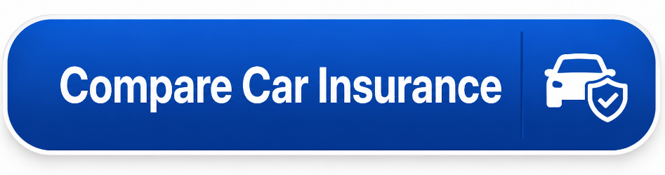

Cheap Car Insurance Quotes (2026): Compare the Best Rates
==========================================================

Finding cheap car insurance quotes starts with comparing prices from multiple insurers. In 2026, **GEICO, Travelers, State Farm, USAA, and Erie Insurance** are among the companies that frequently offer competitive rates. The cheapest option depends on your state, driving history, vehicle, and coverage level, so comparing quotes is the best way to find a lower premium.

Best Cheap Car Insurance Companies
----------------------------------

The table below highlights some of the most popular insurers for affordable coverage.

+-------------------+------------------------------------------+
| Insurance Company | Best For                                 |
+===================+==========================================+
| **GEICO**         | Low-cost minimum coverage                |
+-------------------+------------------------------------------+
| **Travelers**     | Affordable full coverage                 |
+-------------------+------------------------------------------+
| **State Farm**    | Bundling home and auto insurance         |
+-------------------+------------------------------------------+
| **USAA**          | Eligible military members and families   |
+-------------------+------------------------------------------+
| **Erie Insurance**| Low regional rates in selected states    |
+-------------------+------------------------------------------+

These companies are well known for offering competitive pricing, but your actual quote may vary based on your personal profile.

What Affects Your Car Insurance Quote?
--------------------------------------

Insurance companies calculate premiums using several factors, including:

* Your age and driving experience
* Driving record and claims history
* State and ZIP code
* Vehicle make and model
* Annual mileage
* Coverage limits
* Deductible amount
* Previous insurance history

Even if two drivers own the same vehicle, their insurance rates can be different.

How to Compare Car Insurance Quotes
-----------------------------------

Getting multiple quotes only takes a few minutes and helps you avoid paying more than necessary.

1. Enter your driver and vehicle information.
2. Choose the same coverage limits for every quote.
3. Compare premiums from at least three insurers.
4. Review available discounts.
5. Check deductibles and policy features.
6. Select the policy that provides the best value instead of choosing only the lowest price.

Ways to Get Cheaper Car Insurance
---------------------------------

Many drivers can reduce their insurance costs by:

* Comparing quotes every renewal period.
* Maintaining a clean driving record.
* Bundling auto and home insurance.
* Increasing the deductible if appropriate.
* Asking about safe driver, multi-vehicle, and paperless discounts.
* Driving fewer miles if you qualify for low-mileage savings.

Small discounts can add up and significantly reduce your annual premium.

Minimum vs. Full Coverage
-------------------------

**Minimum Coverage**

Minimum coverage meets your state's legal insurance requirements and is usually the least expensive option.

**Full Coverage**

Full coverage includes liability, collision, and comprehensive protection. While it costs more, it provides better financial protection if your vehicle is damaged, stolen, or involved in an accident.

Frequently Asked Questions
--------------------------

**Which company offers the cheapest car insurance?**

For many drivers, **GEICO** is one of the cheapest national insurers for minimum coverage, while **Travelers** often provides competitive full coverage. Eligible military families may find **USAA** offers the lowest rates.

**How many quotes should I compare?**

Comparing quotes from **three to five insurance companies** gives you a better chance of finding the lowest premium.

**Can I switch car insurance at any time?**

Yes. Most drivers can change insurance companies before renewal or during the policy period, although cancellation terms may differ by insurer.

**Does getting insurance quotes affect my credit score?**

In many cases, requesting quotes does not affect your credit score because insurers generally use a soft inquiry where permitted.

Summary
-------

The best way to find cheap car insurance quotes in 2026 is to compare offers from **GEICO, Travelers, State Farm, USAA, and Erie Insurance**. Since every company uses different pricing methods, comparing multiple quotes helps you find affordable coverage without paying more than necessary.

**Compare Car Insurance Quotes**
